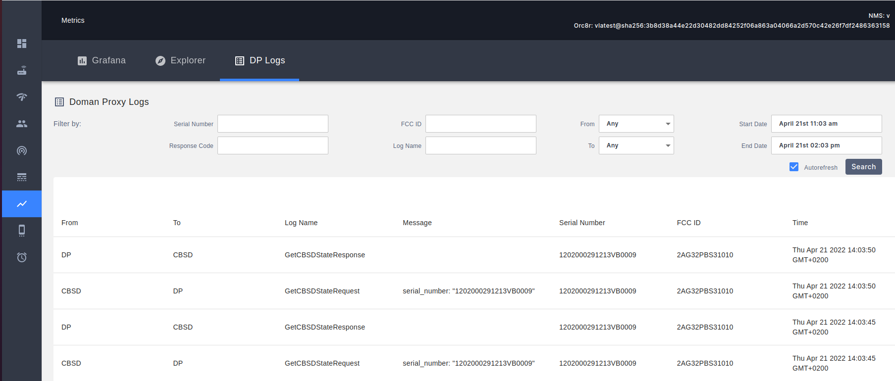
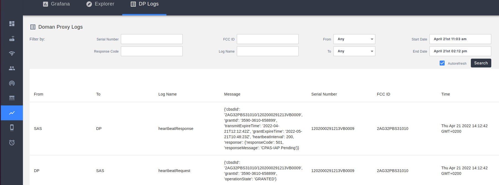

# Debugging

Debugging Domain Proxy usually comes down to checking log content of individual pods. This document describes how to
access these logs.

## eNB <-> AGW/enodebd

To debug the eNB side of Domain Proxy functionality, it typically comes down to inspecting the TR069 session data or
looking into eNB specific data model/state machine implementation in `enodebd`.

To view eNB logs from a TR069 session with `AGW`/`enodebd`, login to AGW and look for the `enodebd` log file:

```console
tail -f /var/log/enodebd.log
```

### eNB TR069 message flow

[TAR.XZ - example set of logs from AGW/enodebd showing the TR069 message flow with setting of params.](../assets/dp/dp_enb_tr069_flow.tar.xz)

[TAR.XZ - example pcap of TR069 session flow between eNB and ACS (enodebd)](../assets/dp/dp_enb_tr069.pcap.tar.xz)

Given the following log snippet (trimmed) from Baicells QRTB, the normal flow should consist of:

1. Initial `Inform` which starts the TR069 session between eNB and ACS (enodebd)

    ```console
    2022-04-25 15:41:17,549 DEBUG Handling TR069 message: Inform {...}
    2022-04-25 15:41:17,550 DEBUG (Inform msg) Received parameter: Device.DeviceInfo.HardwareVersion = ...
    [Inform msg output continues]
    2022-04-25 15:41:17,557 DEBUG State transition from <WaitInformState> to <wait_empty>
    2022-04-25 15:41:17,558 DEBUG Sending TR069 message: InformResponse {'MaxEnvelopes': '1'}
    ```

1. Sequence of `GetParameterValues` messages (Transient, Normal, Object)

    ```console
    2022-04-25 15:41:22,608 DEBUG 10.0.2.243 - "POST / HTTP/1.1" 200 419
    2022-04-25 15:41:22,612 DEBUG Handling TR069 message: DummyInput {}
    2022-04-25 15:41:22,612 DEBUG State transition from <WaitEmptyMessageState> to <check_fw_upgrade_download>
    12022-04-25 15:41:22,613 DEBUG Skipping FW Download for eNB [XXXXXXXXXXXXX], missing firmware upgrade config in enodebd.yml.
    2022-04-25 15:41:22,613 DEBUG State transition from <CheckFirmwareUpgradeDownloadState> to <get_transient_params>
    2022-04-25 15:41:22,613 DEBUG State transition from <SendGetTransientParametersState> to <wait_get_transient_params>
    2022-04-25 15:41:22,613 DEBUG Sending TR069 message: GetParameterValues {...}
    2022-04-25 15:41:22,617 DEBUG 10.0.2.243 - "POST / HTTP/1.1" 200 912
    2022-04-25 15:41:22,662 DEBUG Handling TR069 message: GetParameterValuesResponse {...}
    2022-04-25 15:41:22,662 DEBUG Fetched Transient Params: {...}
    2022-04-25 15:41:22,663 DEBUG State transition from <WaitGetTransientParametersState> to <get_params>
    2022-04-25 15:41:22,664 DEBUG State transition from <GetParametersState> to <wait_get_params>
    2022-04-25 15:41:22,664 DEBUG Sending TR069 message: GetParameterValues {...}
    2022-04-25 15:41:22,671 DEBUG 10.0.2.243 - "POST / HTTP/1.1" 200 3242
    2022-04-25 15:41:22,718 DEBUG Handling TR069 message: GetParameterValuesResponse {...}
    2022-04-25 15:41:22,719 DEBUG Received CPE parameter values: {...}
    2022-04-25 15:41:22,719 DEBUG State transition from <WaitGetParametersState> to <get_obj_params>
    2022-04-25 15:41:22,720 DEBUG State transition from <GetObjectParametersState> to <wait_get_obj_params>
    2022-04-25 15:41:22,720 DEBUG Sending TR069 message: GetParameterValues {...}
    2022-04-25 15:41:22,723 DEBUG 10.0.2.243 - "POST / HTTP/1.1" 200 877
    2022-04-25 15:41:22,769 DEBUG Handling TR069 message: GetParameterValuesResponse {...}
    2022-04-25 15:41:22,770 DEBUG Received object parameters: {...}
    ```

1. `SetParameterValues` message followed by `GetParameterValues` - conditional, only appears if a configuration change needs to be done on the eNB side. The actual parameters that are set in order to enable transmission based on Domain Proxy grant may differ depending on the eNB model and eNB current configuration state. Please refer to your eNB device model implementation in `lte/gateway/python/magma/enodebd/devices`.

    ```console
    2022-04-25 15:41:22,771 DEBUG State transition from <WaitGetObjectParametersState> to <set_params>`
    2022-04-25 15:41:22,772 DEBUG Sending TR069 request to set CPE parameter values: {...}`
    2022-04-25 15:41:22,773 DEBUG State transition from <SetParameterValuesState> to <wait_set_params>`
    2022-04-25 15:41:22,773 DEBUG Sending TR069 message: SetParameterValues {...}`
    2022-04-25 15:41:22,777 DEBUG 10.0.2.243 - "POST / HTTP/1.1" 200 723`
    2022-04-25 15:41:22,837 DEBUG Handling TR069 message: SetParameterValuesResponse {'Status': '0'}`
    2022-04-25 15:41:22,838 INFO Successfully configured CPE parameters!`
    2022-04-25 15:41:22,839 DEBUG State transition from <WaitSetParameterValuesState> to <check_get_params>`
    2022-04-25 15:41:22,840 DEBUG State transition from <GetParametersState> to <check_wait_get_params>`
    2022-04-25 15:41:22,840 DEBUG Sending TR069 message: GetParameterValues {...}`
    2022-04-25 15:41:22,849 DEBUG 10.0.2.243 - "POST / HTTP/1.1" 200 3242`
    2022-04-25 15:41:22,916 DEBUG Handling TR069 message: GetParameterValuesResponse {...}`
    ```

1. Update transmission configuration from Domain Proxy and close TR069 session - `notify_dp` is an `enodebd` transition state that calls the Domain Proxy `GetCBSDState` gRPC API. The `GetCBSDState` response contains data, which indicate whether eNB radio should be disabled/turned off or enabled together with transmission parameters. `GetCBSDState` response data is translated to eNB specific parameters that will be applied to eNB. Please refer to your eNB device model implementation in `lte/gateway/python/magma/enodebd/devices`.

    ```console
    2022-04-25 15:41:22,917 DEBUG State transition from <WaitGetParametersState> to <end_session>
    2022-04-25 15:41:22,917 DEBUG State transition from <BaicellsQRTBEndSessionState> to <notify_dp>
    2022-04-25 15:41:23,046 DEBUG Updating desired config based on sas grant
    2022-04-25 15:41:23,046 DEBUG Sending TR069 message: DummyInput {}
    ```

## AGW/enodebd <-> Domain Proxy

### AGW

To debug AGW communication with Domain Proxy, look for `control_proxy` logs on the AGW calling gRPC API of Domain Proxy:

```console
journalctl -xu magma@control_proxy -r

Apr 21 11:58:00 FreedomFi-Gateway control_proxy[1220289]: 2022-04-21T11:58:00.002Z [127.0.0.1 -> dp_service-controller.codistaging.dp.freedomfi.com,8443] "POST /DPService/GetCBSDState
Apr 21 11:57:55 FreedomFi-Gateway control_proxy[1220289]: 2022-04-21T11:57:54.991Z [127.0.0.1 -> dp_service-controller.codistaging.dp.freedomfi.com,8443] "POST /DPService/GetCBSDState
Apr 21 11:57:50 FreedomFi-Gateway control_proxy[1220289]: 2022-04-21T11:57:50.044Z [127.0.0.1 -> dp_service-controller.codistaging.dp.freedomfi.com,8443] "POST /DPService/GetCBSDState
Apr 21 11:57:45 FreedomFi-Gateway control_proxy[1220289]: 2022-04-21T11:57:45.002Z [127.0.0.1 -> dp_service-controller.codistaging.dp.freedomfi.com,8443] "POST /DPService/GetCBSDState
```

`control_proxy` logs will show if gRPC calls from `enodebd` towards Domain Proxy are made. Since gRPC is binary coded, there isn't much information from tcpdump capture on this end of communication.
Domain Proxy gRPC call details can be viewed in [NMS](#nms).

### NMS

`enodebd` gRPC calls towards Domain Proxy are visible in NMS: `[Metrics]` menu, `[DP Logs]` tab in a human readable form.
An `empty` message (blank content in the column) is equivalent to no SAS grant data being sent - which in turn is interpreted by `AGW`/`enodebd` as
no transmission and the radio transmission must be disabled.



## Domain Proxy <-> SAS

Domain Proxy logs of communication with Spectrum Access System (SAS) are visible in NMS: `[Metrics]` menu, `[DP Logs]` tab



## Gettings logs from Domain Proxy pods

### Listing Domain Proxy pods in Kubernetes

To list Domain Proxy pods running in production environment type:

```console
kubectl -n orc8r get pod -l app.kubernetes.io/name=domain-proxy
```

You will get an output similar to this:

```console
NAME                                                    READY   STATUS      RESTARTS   AGE
domain-proxy-active-mode-controller-7b984c6579-zmwrm    1/1     Running     0          13d
domain-proxy-configuration-controller-6d99c978f-b8h6b   1/1     Running     0          13d
domain-proxy-radio-controller-5c868696d9-s7vgg          1/1     Running     0          13d
```

## Check individual pods' logs

To view logs from individual Domain Proxy pods, execute `kubectl logs` with one of the pod names listed in the [previous chapter](#listing-domain-proxy-pods-in-kubernetes).

- `Radio Controller` (RC) logs:
    - logs related to AGW/enodebd <-> Domain Proxy communication
    - logs related to requests generated by Active Mode Controller (Domain Proxy logic, which generates appropriate SAS requests)
    - logs related with Database modifications, which were the result of incoming API calls (either from AGW or AMC)
- `Configuration Controller` (CC) logs:
    - logs related to Domain Proxy <-> SAS communication
    - logs related with Database modifications, which were the result of processing SAS responses
- `Active Mode Controller` (AMC) logs:
    - logs related to internal business logic of Domain Proxy functionality
    - logs related to Database state management
    - logs related to generated SAS requests based on Database state

Example commands for gettings the logs:

```console
# Last 1000 lines of logs on a specific pod
kubectl logs --tail=1000 domain-proxy-active-mode-controller-7b984c6579-zmwrm

# Last hour worth of logs
kubectl logs --since=1h domain-proxy-active-mode-controller-7b984c6579-zmwrm

# Live preview mode
kubectl logs -f domain-proxy-active-mode-controller-7b984c6579-zmwrm
```
