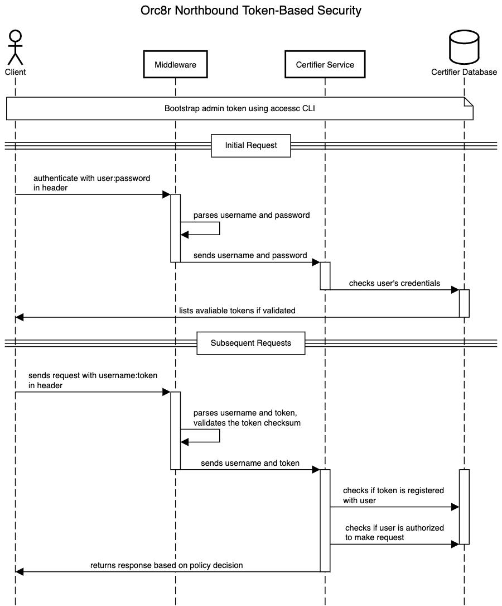

# REST API Auth

## Motivation

Orc8r’s current northbound security currently uses operator-managed x509 client certificates.
For more information on the current Orc8r current security architecture, read [Security Overview](./architecture_security.md#application-layer-access-control) for a general overview.

To improve our security measures and to allow for more fine-grained control over resource access, we added tokens that must be sent along with each REST API request in the header.

## Overview


For Orc8r’s northbound interface security, all REST API requests must include a client certificate and a `<username>:<token>` in the Basic Auth header.

To access REST API resources, perform the following steps:

1. Log in with their username and password through the `/login` endpoint
2. Copy the token from the response body
3. Authenticate with their username and token (in lieu of the password field) through the Swagger Authorize tool on the top right corner
   
   

## Bootstrapping Admin Token

The initial admin user and its token can be generated via the accessc CLI.
Exec into your Orc8r application container, then run the command `/var/opt/magma/bin/accessc add-admin-token ROOT_USERNAME ROOT_PASSWORD`.
This would automatically generate a user that has access to the entirety of the REST API.

## Managing Users

To create additional users, an admin can use the `/user` endpoint to create, list, delete, and update users.

_Note:_ By default, the newly created user will not have read/write access permissions to any resource.
To give the newly created user access to anything, you must create a token for that user specifying their permissions as specified in the next section.

## Managing Tokens

Creating access tokens for users can be done simply using `POST /user/{username}/token` endpoint by including policies in the response body.
The general schema for creating policies is the following:

```javascript
[
    {
        "effect": ["allow", "deny"],
        "action": ["read", "write"],
        "resourcetype": ["uri", "network_id", "tenant_id"],
        "path": "",         // filled when resourcetype is uri
        "resourceids": []   // filled when resourcetype is network_id or tenant_id
    },
]
```

An example of the response body for creating an admin token that could read and write to all the endpoints would be the following.
This policy is also the default policy added to the user when bootstrapping the admin token.

```json
[
    {
    "effect": "ALLOW",
    "action": "WRITE",
    "resourceType": "URI",
    "path": "**"
    }
]
```

This is an example for creating a non-admin token where a user is allowed read access to all resources,
denied write access to the networks `[network1, network2]`:

```json
[
    {
        "effect": "ALLOW",
        "action": "WRITE",
        "resourceType": "URI",
        "path": "**",
    },
    {
        "effect": "DENY",
        "action": "WRITE",
        "resourceType": "NETWORK_ID",
        "resourceIDs": ["test_network1", "test_network2"]
    },
]
```

This is an example of a tenant-scoped policy where the user is allowed read access to all resources
and allowed write access to the tenants with the IDs of `[0, 1, 2]` and all the tenants' networks:

```json
[
    {
        "effect": "ALLOW",
        "action": "READ",
        "resourceType": "URI",
        "path": "**",
    },
    {
        "effect": "ALLOW",
        "action": "WRITE",
        "resourceType": "TENANT_ID",
        "resourceIDs": ["0", "1"]
    },
]
```

## Reaching a policy decision

Reaching a policy decision is a multi-step process handled by the certifier service.
The certifier service does the following:

1. Checks if the token is valid (i.e., has the correct token prefix and checksum)
2. Authenticates the user by ensuring the token is registered with the user
3. Obtains the policy specified by the token and checks if the user’s request is allowed under the given permissions

_Note:_ For conflicting entries in the policy (e.g., one policy specifies ALLOW and the other DENY), the DENY effect will take precedent.
For requested resources that do not have any policies addressing it (e.g., if the policy only allowed access to one network the user requests any other network), the policy decision defaults to DENY as well.
