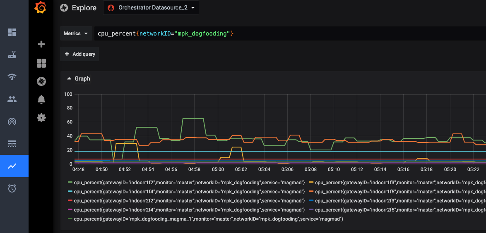

# Life of a Magma Metric

A metric in Magma deployments may originate at gateways (AGW, FeG, etc.), Orc8r, or other targets (Postgres, AWS, etc.). In this document, we focus on the life of a metric that originates at the AGW, travels through the Orc8r to [Prometheus](https://prometheus.io/), and is eventually displayed on the NMS UI.


## Phase 1: Collection and export

On the AGW, metrics are collected and exported from Python and C++ services.

### Python services

Every Python service on the access gateway defines Prometheus counters, gauges, and histograms in a `metrics.py` file. The _subscriberdb_ service, for example, defines the following Prometheus metrics in its [metrics.py](https://sourcegraph.com/github.com/magma/magma@v1.6.0/-/blob/lte/gateway/python/magma/subscriberdb/metrics.py) file, among others

```python
# metrics.py

SUBSCRIBER_SYNC_SUCCESS_TOTAL = Counter(
    'subscriber_sync_success',
    'Total number of successful subscriber syncs with cloud',
)

SUBSCRIBER_SYNC_FAILURE_TOTAL = Counter(
    'subscriber_sync_failure',
    'Total number of failed subscriber syncs with cloud',
)

```

It is then up to the service to set the values of these metrics appropriately, i.e., take the actual measurements. _Subscriberdb_ increments its `SUBSCRIBER_SYNC_SUCCESS_TOTAL` counter in its [client.py](https://sourcegraph.com/github.com/magma/magma@v1.6.0/-/blob/lte/gateway/python/magma/subscriberdb/client.py) file after fetching subscriber data from the cloud successfully.

```python
# client.py

logging.info("Successfully fetched all subscriber pages from the cloud!", )
SUBSCRIBER_SYNC_SUCCESS_TOTAL.inc()
```

Each Python service on the AGW extends the `MagmaService` class which implements the Service303 interface. This interface has the [`GetMetrics`](https://sourcegraph.com/github.com/magma/magma@v1.6.0/-/blob/orc8r/gateway/python/magma/common/service.py?L403:9) method which uses the [`metrics_export`](https://sourcegraph.com/github.com/magma/magma@v1.6.0/-/blob/orc8r/gateway/python/magma/common/metrics_export.py?L22:5) module to get metrics from the Python Prometheus client and encode them for export over gRPC.

```python
# metrics_export.py

def get_metrics(registry=REGISTRY, verbose=False):
    # ...
    for metric_family in registry.collect():
        if metric_family.type in ('counter', 'gauge'):
            family_proto = encode_counter_gauge(metric_family, timestamp_ms)
    # ...
```

While each service defines and sets its own metrics, it is up to the _magmad_ service to collect metrics from all services and export them to the Orc8r. When the _magmad_ service gets started, it reads metrics configuration from [magmad.yml](https://sourcegraph.com/github.com/magma/magma@v1.6.0/-/blob/feg/gateway/configs/magmad.yml). Then, _magmad_ schedules its [`MetricsCollector`](https://sourcegraph.com/github.com/magma/magma@v1.6.0/-/blob/orc8r/gateway/python/magma/magmad/metrics_collector.py) object to collect and upload metrics every `metrics_config.sync_interval` seconds. The `MetricsCollector` object loops over all Python services and for each, calls `GetMetrics` over gRPC to obtain metrics from the Python service. Then, it divides the gRPC structures into chunks of 1 MB or less, and uploads these chunks to the _metricsd_ Orc8r service over gRPC through the `Collect` method in _metricsd_.

```python
# metrics_collector.py

def sync(self, service_name):
    # ...
    chan = ServiceRegistry.get_rpc_channel(
        'metricsd',
        ServiceRegistry.CLOUD,
        grpc_options=self._grpc_options,
    )
    client = MetricsControllerStub(chan)
    # ...
    sample_chunks = self._chunk_samples(samples)
    for idx, chunk in enumerate(sample_chunks):
        # ...
        future = client.Collect.future(
            metrics_container,
            self.grpc_timeout,
        )
    # ...
```

### C/C++ services

Each C/C++ service also exposes the `GetMetrics` method that the _magmad_ service uses to fetch collected metrics over gRPC. The [`MetricsSingleton`](https://sourcegraph.com/github.com/magma/magma@v1.6.0/-/blob/orc8r/gateway/c/common/service303/MetricsSingleton.cpp) class provides helpers and wrappers around the Prometheus C++ client. [`MetricsHelpers.cpp`](https://sourcegraph.com/github.com/magma/magma@v1.6.0/-/blob/orc8r/gateway/c/common/service303/MetricsHelpers.cpp) further wraps `MetricsSingleton` methods to make it even more convenient for Magma services to set and upload Prometheus metrics.

Similar to Python services, _magmad_ divides the metrics collected from C++ services into chunks of 1 MB or less, and uploads them over gRPC to _metricsd_ in the Orc8r.

## Phase 2: Orchestrator and Prometheus

The _metricsd_ cloud service reads metric names and labels from enums defined in [`metricsd.proto`](https://sourcegraph.com/github.com/magma/magma@v1.6.0/-/blob/orc8r/protos/metricsd.proto) and accepts gRPC messages accordingly. Once it has received metrics from the AGW, _metricsd_ pushes them again over gRPC to the [`MetricsExporter`](https://sourcegraph.com/github.com/magma/magma@v1.6.0/-/blob/orc8r/cloud/go/services/metricsd/protos/exporter.proto) servicers in its `Collect` method.

```go
// metricsd/servicers/servicer.go

func (srv *MetricsControllerServer) Push(ctx context.Context, in *protos.PushedMetricsContainer) (*protos.Void, error) {
    // ...
    metricsExporters, err := metricsd.GetMetricsExporters()
    // ...
    for _, e := range metricsExporters {
        err := e.Submit(metricsToSubmit)
        // ...
    }
```

This is one of the [extensions supported in the Orc8r](orc8r/architecture_modularity) and the label `orc8r.io/metrics_exporter` can be used to export metrics to any data sink. By default, the `GRPCPushExporterServicer`, which is registered in the [`orchestrator`](https://sourcegraph.com/github.com/magma/magma@v1.6.0/-/blob/orc8r/cloud/go/services/orchestrator/orchestrator/main.go?L66) service, is the only metrics exporter. So `GRPCPushExporterServicer`, through its `Submit` method, pushes metrics over gRPC to Prometheus Edge Hub.

```go
// grpc_exporter_servicer.go

func (s *GRPCPushExporterServicer) pushFamilies(families []*io_prometheus_client.MetricFamily) error {
    // ...
    client, err := s.getClient()
    if err != nil {
        return err
    }
    _, err = client.Collect(context.Background(), &edge_hub.MetricFamilies{Families: families})
    // ...
}
```

[Prometheus Edge Hub](https://github.com/facebookarchive/prometheus-edge-hub) is a Facebook project that replaces the Prometheus Pushgateway. Orc8r's Prometheus service [scrapes](https://sourcegraph.com/github.com/magma/magma@v1.6.0/-/blob/orc8r/cloud/helm/orc8r/charts/metrics/templates/prometheus.deployment.yaml#L160-L168) and drains the Edge Hub so metrics finally arrive at their home in the Prometheus server. [On a dev environment](https://sourcegraph.com/github.com/magma/magma@v1.6.0/-/blob/orc8r/cloud/docker/docker-compose.metrics.yml?L14-24), the Prometheus server runs at [localhost:9090](https://localhost:9090).

## Phase 3: NMS and Grafana

The NMS initially reads metric names, descriptions and their corresponding PromQL from [`LteMetrics.json`](https://sourcegraph.com/github.com/magma/magma@v1.6.0/-/blob/nms/app/packages/magmalte/data/LteMetrics.json). Then, in [`Explorer.js`](https://sourcegraph.com/github.com/magma/magma@v1.6.0/-/blob/nms/app/packages/magmalte/app/views/metrics/Explorer.js), it filters relevant metrics for the network in question using the `/networks/{network_id}/prometheus/series` Orc8r endpoint.

```javascript
// Explorer.js

export default function MetricsExplorer() {
    // ...
    // filter only those metrics which are relevant to this network
    const metricsMap = {};
    if (metricSeries != null) {
        metricSeries.forEach((labelSet: prometheus_labelset) => {
            metricsMap[labelSet['__name__']] = labelSet;
        });
    }
    // ...
}
```

This endpoint is part of the _metricsd_ Orc8r service, and uses the [`QueryRestrictor`](https://sourcegraph.com/github.com/magma/magma@v1.6.0/-/blob/orc8r/cloud/go/services/metricsd/prometheus/restrictor/query_restrictor.go) interface to ensure that only metrics with the right labels (network, gateway etc.) are returned.

```go
// query_restrictor.go

// RestrictQuery appends a label selector to each metric in a given query so
// that only metrics with those labels are returned from the query.
func (q *QueryRestrictor) RestrictQuery(query string) (string, error) {
    // ...
    promQuery, err := promql.ParseExpr(query)
    // ...
    promql.Inspect(promQuery, q.addRestrictorLabels())
    return promQuery.String(), nil
}
```

Magma provides [dashboards](https://sourcegraph.com/github.com/magma/magma@v1.6.0/-/blob/nms/app/packages/magmalte/grafana) to visualize and explore the collected metrics. In the NMS dashboard > Metrics > Explorer UI, each metric gets a [Grafana](https://grafana.com) `<iframe>` which connects to the Grafana Data Source API. In turn, the Grafana Data Source API proxies the parameterized metric request to Prometheus and displays the retrieved metrics.


